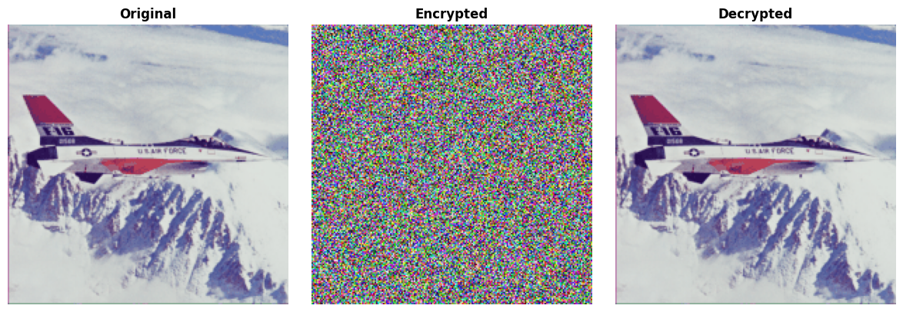
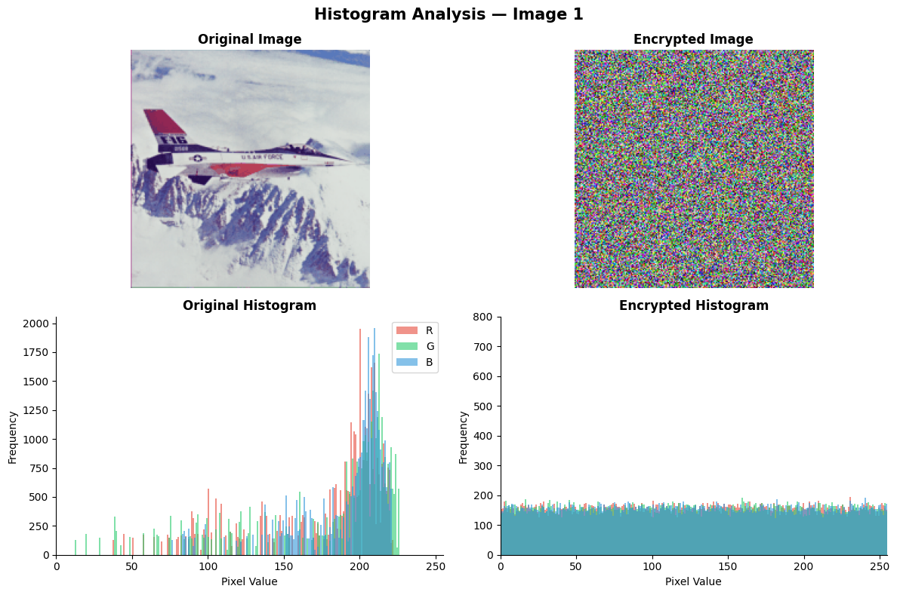
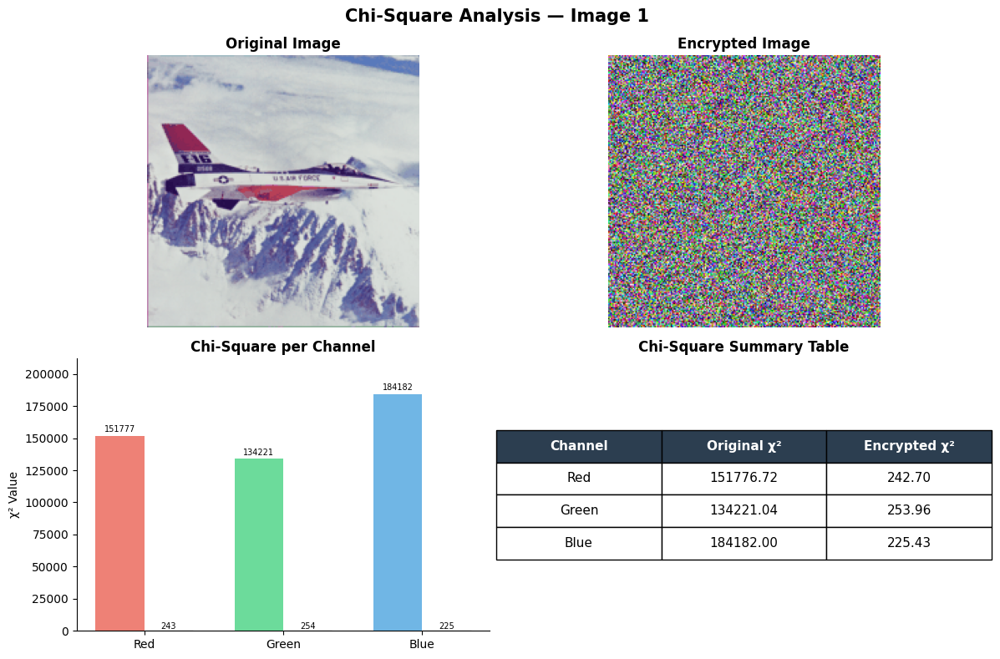
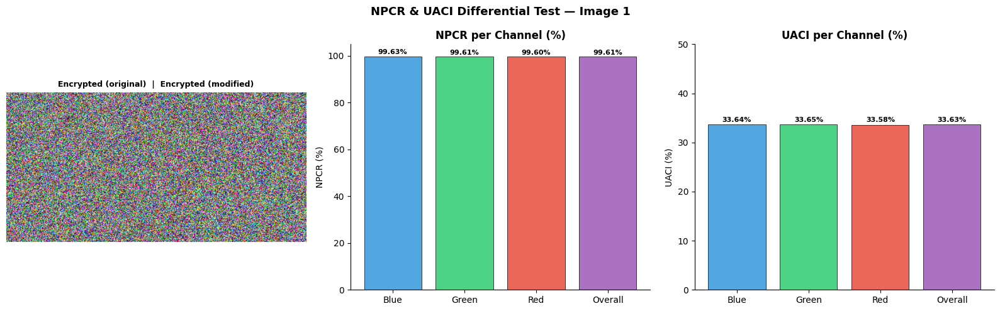
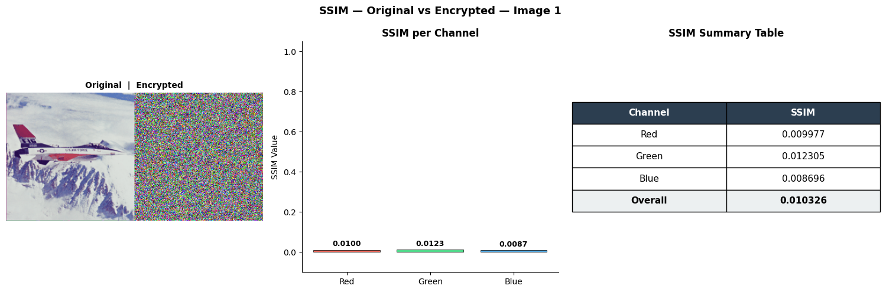
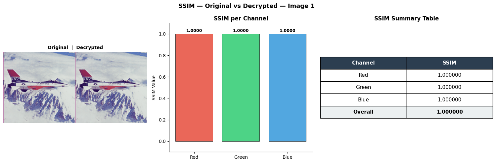
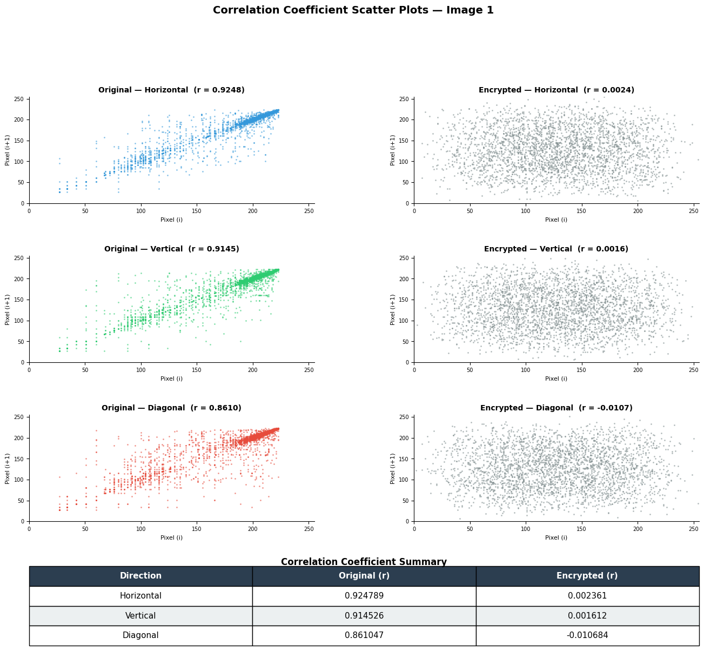

## 🚀 Features

- Multi-layer encryption (ACM + SVD + Chaos + Diffusion)
- High randomness (Entropy close to ideal value ~8)
- Uniform pixel distribution (Chi-Square test)
- Strong resistance to differential attacks (NPCR & UACI)
- Low pixel correlation after encryption
- Accurate decryption (high SSIM)

---

## 📊 Security Analysis

This system is evaluated using multiple cryptographic metrics:

- **Entropy** → Measures randomness of encrypted image  
- **Chi-Square Test** → Checks uniform distribution of pixel values  
- **NPCR & UACI** → Resistance against differential attacks  
- **SSIM** → Structural similarity (Decryption accuracy)  
- **Correlation Coefficient** → Pixel independence analysis  

---

## 📊 Results

### Encrypted + Decrypted

### Histogram

### Chi-Square

### NPCR & UACI

### SSIM

### Correlation

---

## 🧠 Key Insight

The combination of chaotic maps and SVD significantly improves:
- Security (randomness + diffusion)
- Resistance to statistical & differential attacks
- Reversibility with minimal information loss

---

## 📁 Project Structure

